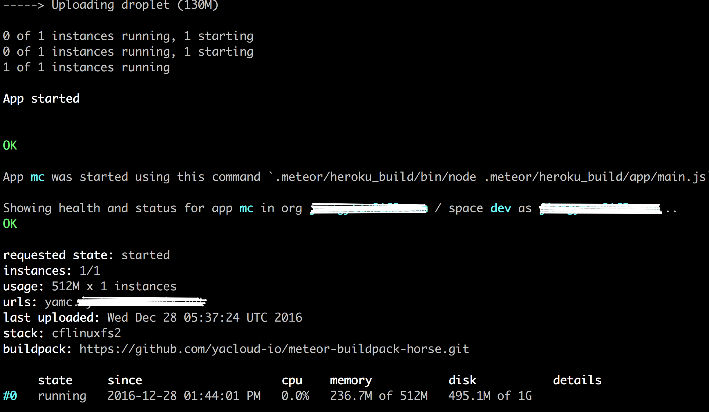

## Mongoclient, MongoDB Management Tool
Cross-platform, easy to use, MongoDB 3.4+ support and more features!

[](https://travis-ci.org/rsercano/mongoclient)
[](https://codeclimate.com/github/rsercano/mongoclient)
[](https://www.codacy.com/app/ozdemirsercan27/mongoclient?utm_source=github.com&amp;utm_medium=referral&amp;utm_content=rsercano/mongoclient&amp;utm_campaign=Badge_Grade)
[](https://github.com/rsercano/mongoclient)
[](https://github.com/rsercano/mongoclient)
[](https://hub.docker.com/r/mongoclient/mongoclient/)
[](https://github.com/rsercano/mongoclient/blob/master/LICENSE)


[](https://www.paypal.com/cgi-bin/webscr?cmd=_s-xclick&hosted_button_id=Y5VD95E96NU6S)

*Mongoclient is in need of you to buy [INSPINA](https://wrapbootstrap.com/theme/inspinia-responsive-admin-theme-WB0R5L90S) theme's extended licence ($1000) to live longer. Thank you so much ! [Here's the list of donators, helpful people](https://github.com/rsercano/mongoclient/wiki/Donators) Can't you donate, no worries giving a star to this repository is free  and appreciated as much as donation !*

[Try Demo Application](http://www.mongoclient.com:3000)

   Database Monitoring     | Easy GridFS, Dump/Restore Management
-------------------------|-------------------------
  | 

   Autocomplete     | User Management
-------------------------|-------------------------
  | 


## Download
Version 1.4.0 has been released ! Chat is back, for more info checkout breaking changes from inside of application.

### Distributions

* [Linux x64](https://github.com/rsercano/mongoclient/releases/download/1.4.0/linux-portable-x64.zip)
* [Windows x64](https://github.com/rsercano/mongoclient/releases/download/1.4.0/windows-portable-x64.zip)
* [OSx](https://github.com/rsercano/mongoclient/releases/download/1.4.0/osx-portable.zip)
* [Web Application](https://github.com/rsercano/mongoclient/wiki#31-compile-from-source-browser-edition)

To learn more see the [wiki](https://github.com/rsercano/mongoclient/wiki) page.

## Docker
Mongoclient now officialy has a docker hub. To install master branch:

```docker pull mongoclient/mongoclient```

To install latest stable release:

```docker pull mongoclient/mongoclient:1.4.0```

Then you can run it as a daemon:

```docker run -d -p 3000:3000 mongoclient/mongoclient```

## Cloud Foundry
You can optionally push the Mongoclient to the CloudFoundry

Cloud Foundry or CF, is a PaaS, as a developer you can trail the instance of CF, either [IBM Bluemix](https://console.ng.bluemix.net) or [Pivotal](https://console.run.pivotal.io) 

As the MongoClient is developed by the meteor, you need to have an mongodb instance to store the metadata info MC needed.
[Mlab](https://mlab.com) has an experimental or sandbox offering or [compose](https://www.compose.com/) a commerical DBaaS provider you can register and try it.

Assuming you have an mongodb instance, which something linke  
``` mongodb://<dbuser>:<dbpassword>@ds145188.mlab.com:45188/mongodb-mc ```

And installed the [command line utility](https://docs.cloudfoundry.org/cf-cli/install-go-cli.html)

Get the latest MongoClient

```
git clone https://github.com/yacloud-io/mongoclient.git ~/mongoclient
cd ~/mongoclient
```

edit the manifest.yml.sample, change the corresponding values to your environment

```
mv manifest.yml.sample manifest.yml
cf login -a api.ng.bluemix.net -u username -p password
cf push
```

after a while, your console will output something like 



## History
Please check [history](https://github.com/rsercano/mongoclient/blob/master/HISTORY.MD) file for version information.

## Roadmap
Please check [roadmap](https://github.com/rsercano/mongoclient/blob/master/ROADMAP.MD) file for further features.

## License
Project is licensed under [MIT](https://en.wikipedia.org/wiki/MIT_License), which means you are free to do anything with full of my work as long as you provide attribution back to me. Thanks !
